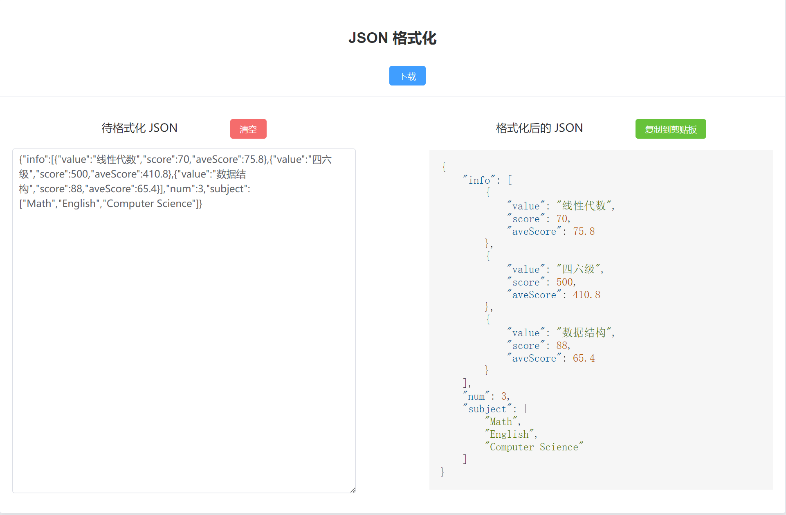

# 云胡工具集 01: Json 格式化


## 一、布局
将 `el-card` 卡片放在中间, 宽度是屏幕宽度的一半。

```css
.box-card {
  margin: 0 auto;
  text-align: center;  
  width: 50%;
}
```

左侧是用户输入框，右侧是格式化后的 `Json` 代码。

## 二、功能实现

### 2.1 Json 格式化

监听待格式化的 `Json` 字符串，然后将其转成 `Json` 对象, 再将其转为带有格式的 `Json` 字符串。

必须使用异常处理，`JSON.parse(jsonObject)` 在解析不正确的`Json` 对象会报错。
```javascript
     /**
     * 监听原来的未格式化的 json 字符串，必须使用 try catch 异常处理，否则会报错
     *
     * @param oldJson 用户输入的未格式化的 json 字符串，最开始是空
     * @param newValue 用户改变后的新的值
     */
    watch(oldJson, (newValue, oldValue) => {
        const jsonFormatSpace = 4; // json 格式化的缩进
        if (typeof newValue == "string" && newValue !== "" && newValue != null) {
            try {
                // 把 json 字符串转为 json 对象
                let newValueJsonObject = JSON.parse(newValue);
                // 将 json 对象通过 4 个缩进格式化，实现美化功能
                formatJson.value = JSON.stringify(newValueJsonObject, null, jsonFormatSpace);
            } catch (e) {
                ElMessage.error('待格式化的 Json 有误，请检查');
                console.log(e);
                formatJson.value = '';
            }
        }
        if (newValue === "") {
            formatJson.value = '';
        }
    });
```
### 2.2 下载 Json 到本地

引入 `moment.js` 时间处理插件。

安装 `npm install --save moment`，注意加上 `--save`，会下载 `moment` 库并且会在 `package.json`的`dependencies`中写入。

之后，如果在其他地方 `npm install` 下载的时候也会安装上。

如果不加 `--save` 只会在本地下载，不会写入到 `package.json` 中。

使用 `moment().format('YYYY-MM-DD-hh-mm-ss')` 来获取当前的日期和时间作为格式化后的`json`文件名。

```javascript
    /**
     * 点击下载
     */
    function clickDownload() {
        if (formatJson.value === "") {
            ElMessage.error('下载空 Json 没有意义');
            return;
        }
    
        let eleLink = document.createElement("a");
        const fileName = moment().format('YYYY-MM-DD-hh-mm-ss');
    
        eleLink.download = fileName + '.json';
        eleLink.style.display = "none";
        // 字符内容转变成 blob 地址
        let blob = new Blob([formatJson.value], {type: "text/json"});
        eleLink.href = URL.createObjectURL(blob);
        // 触发点击
        document.body.appendChild(eleLink);
        eleLink.click();
        // 然后移除
        document.body.removeChild(eleLink);
    }
```
### 2.3 复制 Json 到剪切板

使用 `vue-clipboard3` 库来实现复制到剪切板功能。

安装: `npm install --save vue-clipboard3`

引入: `import useClipboard from "vue-clipboard3"`

```javascript
    /**
     * 点击复制 json 到剪切板
     */
    async function clickCopy() {
      const {toClipboard} = useClipboard();
      if (formatJson.value == null || formatJson.value === "") {
        ElMessage.error("无法复制空的 json ");
        return;
      }
      try {
        await toClipboard(formatJson.value);
        ElMessage.success("复制格式化后的 json 到剪切板成功")
      } catch (e) {
        console.error(e);
        ElMessage.error("复制格式化后的 json 到剪切板失败");
      }
    }
```
### 2.4 高亮 Json 代码

安装 `highlight` 和 `@highlightjs/vue-plugin`。 

```bash
npm install --save highlight.js
npm install --save @highlightjs/vue-plugin
```

在 `main.js` 中引入 `Json` 高亮支持:
```js
import 'highlight.js/styles/stackoverflow-light.css'
import hljs from 'highlight.js/lib/core';
import json from 'highlight.js/lib/languages/json'
import hljsVuePlugin from "@highlightjs/vue-plugin";

hljs.registerLanguage('json', json);

app.use(hljsVuePlugin);
```

使用：
```vue
<highlightjs language='json' :code= "formatJson" class = "highlight-json"/>
```

`:code` 支持响应式数据。

## 三、结果


## 四、后记
最近打算一边做点小玩具一边练习前端的技术，这是工具集的第一个功能，后面会慢慢加上新的功能。


小声说下 `CSS` 真的好难啊，每次调半天，(逃